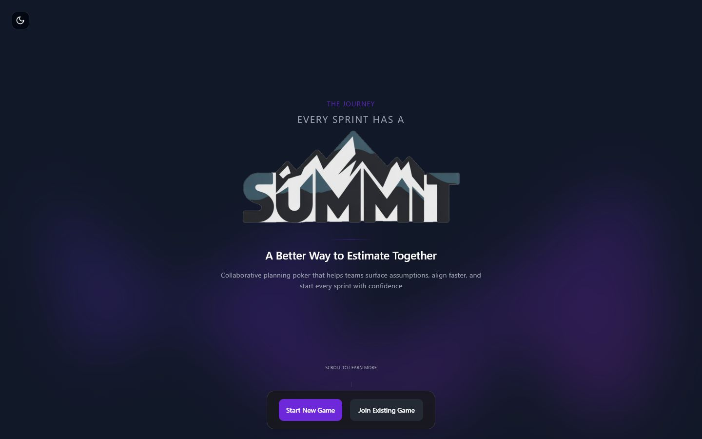
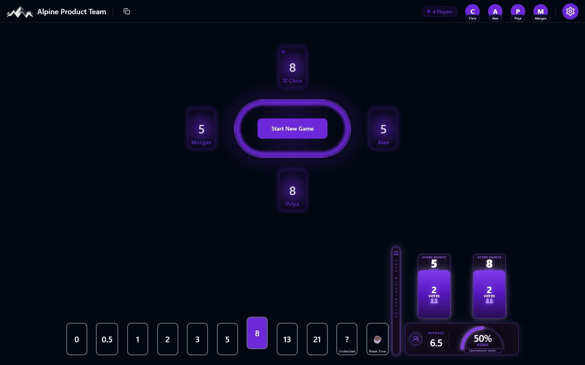
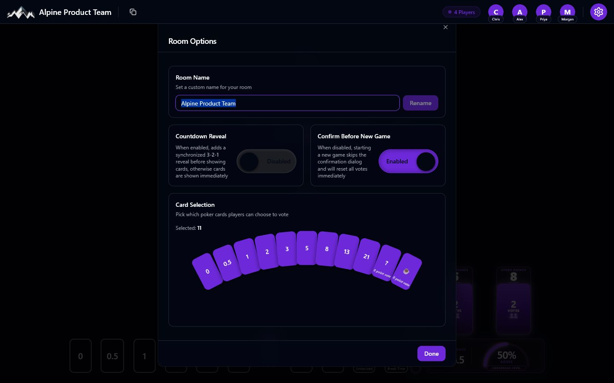
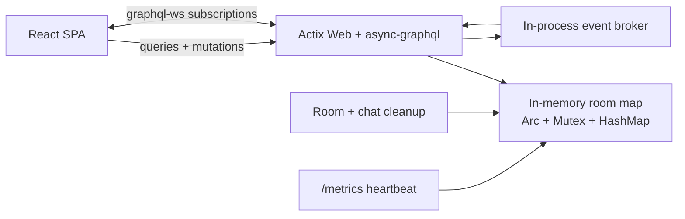

# Summit Planning Poker

A fast, free, real-time planning poker app for teams that want better estimates and better conversations.

[**Launch Summit**](https://www.summitplanningpoker.com/) &middot; [Run locally](#getting-started) &middot; [Contribute](#contributing)

[](LICENSE)




## Estimation should create alignment

Summit gives a team one shared room for voting, revealing, and discussing estimates. Create a room, share its URL, and start a round--no account or project setup required.

- **Vote together in real time.** Every participant sees joins, votes, reveals, chat, and new rounds immediately.
- **Keep estimates independent.** Cards stay hidden until the room owner reveals the round.
- **See the shape of the result.** The results panel groups votes and calculates the numeric average, agreement, and consensus level.
- **Facilitate the room.** Rename the room, choose the deck, enable a synchronized 3-2-1 reveal, and control new-round confirmations.
- **Make discussion part of the session.** Use live chat, rich text, emoji, GIFs, quick reactions, and hand raising.
- **Manage larger sessions.** Room owners can kick or ban participants when needed.
- **Make it yours.** Switch themes, change the accent color, and enable the optional mountain-and-stars background.

## Inside a Summit room

### Reveal estimates and spot disagreement

The room updates over GraphQL subscriptions. When the owner reveals a round, every player sees the values and the same distribution summary.



### Configure the session

Room owners can change the name and deck at any time, opt into a countdown reveal, and decide whether a new round needs confirmation.



## Technology

| Area    | Stack                                                            |
| ------- | ---------------------------------------------------------------- |
| Client  | React 19, TypeScript, Vite, TanStack Router                      |
| Data    | Apollo Client, GraphQL HTTP, `graphql-ws` subscriptions          |
| UI      | Tailwind CSS, shadcn/ui, Radix UI, Framer Motion, Recharts       |
| Server  | Rust, Actix Web, async-graphql, Tokio                            |
| Testing | Vitest, Playwright, custom protocol and browser stress harnesses |
| Hosting | DigitalOcean App Platform                                        |

## Getting started

### Prerequisites

- [Git](https://git-scm.com/)
- [Node.js 20 or newer](https://nodejs.org/) and npm
- [Rust](https://www.rust-lang.org/tools/install)

### 1. Clone the repository

```sh
git clone https://github.com/INQTR/poker-planning.git
cd poker-planning
```

### 2. Start the GraphQL server

```sh
cd server
cargo run
```

The server starts on `http://127.0.0.1:8000/`. That URL also hosts the GraphQL playground. Health and Prometheus endpoints are available at `/health_check` and `/metrics`.

For automatic restarts during Rust development:

```sh
cargo install cargo-watch
cargo watch -x run
```

### 3. Start the client

In a second terminal:

```sh
cd client
npm install
cp .env.local.example .env.local
npm run dev
```

PowerShell equivalent for the copy step:

```powershell
Copy-Item .env.local.example .env.local
```

Open `http://127.0.0.1:5173/`.

### Environment variables

The two GraphQL URLs are required. Analytics and GIPHY are optional for local development.

| Variable                   | Purpose                                              | Local default            |
| -------------------------- | ---------------------------------------------------- | ------------------------ |
| `VITE_GRAPHQL_ENDPOINT`    | GraphQL queries and mutations                        | `http://127.0.0.1:8000/` |
| `VITE_GRAPHQL_WS_ENDPOINT` | GraphQL subscriptions                                | `ws://127.0.0.1:8000/`   |
| `VITE_GOOGLE_ANALYTICS_ID` | Production-only Google Analytics injection           | Optional                 |
| `VITE_GIPHY_KEY`           | GIF search during local client development           | Optional                 |
| `GIPHY_KEY`                | Server-side GIPHY proxy                              | Optional                 |
| `PORT`                     | Overrides the server port                            | `8000`                   |
| `APP_ENVIRONMENT`          | Selects `local` or `production` server configuration | `local`                  |

## Architecture



The server deliberately keeps the system small:

- Room state lives in memory; there is no database.
- A typed in-process broker publishes complete room snapshots to subscribed clients after state changes.
- Rooms inactive for more than eight days are removed when safe to evict.
- Chat history is limited to the latest 100 messages, and messages older than 48 hours are pruned.
- Storage and subscriptions are process-local, so the current architecture must run as a **single server instance**. A server restart clears every room.

The client uses generated GraphQL types as its API contract. Operations live in `client/src/api/operations.graphql`; generated files are not edited by hand.

## Development workflow

### Client

Run these commands from `client/`:

```sh
npm run dev       # Vite development server
npm run build     # production build
npm run lint      # ESLint, zero warnings allowed
npm run checkTs   # TypeScript type check
npx vitest run    # unit and component tests once
```

### GraphQL code generation

After changing the Rust schema:

1. Restart the server on `127.0.0.1:8000`.
2. Run the generator from `client/`.
3. Commit the updated generated types with the schema/client changes.

```sh
npm run codegen
```

### Server

Run these commands from `server/`:

```sh
cargo run
cargo test
```

## Testing

### Unit and end-to-end tests

With the server and client development server running:

```sh
cd client
npx vitest run
npm run test:e2e
```

Use `npm run test:e2e:ui` for Playwright's interactive runner.

### Full suite

Install dependencies in both `client/` and `stress/`, then run the server with its speed-optimized profile and the client with Vite:

```sh
# terminal 1
cd server
HEARTBEAT_INTERVAL_SECS=1 RUST_LOG=warn cargo run --profile bench-release

# terminal 2
cd client
npm run dev

# terminal 3, from the repository root
node test-all.mjs
```

PowerShell server command:

```powershell
cd server
$env:HEARTBEAT_INTERVAL_SECS="1"
$env:RUST_LOG="warn"
cargo run --profile bench-release
```

The full runner covers client unit tests, functional and game-correctness E2E tests, protocol stress scenarios, baseline regression checks, and browser rendering under load.

### Capacity and stress testing

The `stress/` workspace drives the real GraphQL HTTP and WebSocket protocol without launching hundreds of browsers.

```sh
cd stress
npm install
npm run smoke
npm run find-limits
```

Individual scenarios cover vote cycles, chat storms, one-room capacity, concurrent-room capacity, mutation throughput, multi-room contention, and soak testing. See [stress/README.md](stress/README.md) for flags, baselines, reports, and production safety limits.

## Deployment

[`spec.yaml`](spec.yaml) defines the production topology for DigitalOcean App Platform:

- one Rust web service for GraphQL, WebSockets, GIPHY proxying, health checks, and metrics;
- one static Vite site for the React client;
- automatic deployments from `main`;
- `/graphql` routed to the server and `/` routed to the SPA.

The single server instance is intentional because room storage and pub/sub are in-process. Moving to horizontal scaling requires shared persistence and a distributed event broker first.

## Repository layout

```text
.
|-- client/          React + TypeScript application
|-- server/          Rust GraphQL server
|-- stress/          Protocol-level capacity and regression harness
|-- docs/images/     README screenshots
|-- spec.yaml        DigitalOcean App Platform specification
`-- test-all.mjs     Full local test orchestrator
```

## Contributing

Contributions are welcome. Development normally targets the `dev` branch.

1. Fork the repository and create a focused branch.
2. Add or update tests with the change.
3. Run the relevant client, server, and stress checks.
4. Open a pull request with the behavior change and verification notes.

Please follow the [Code of Conduct](CODE_OF_CONDUCT.md).

## License

Summit Planning Poker is available under the [MIT License](LICENSE).
